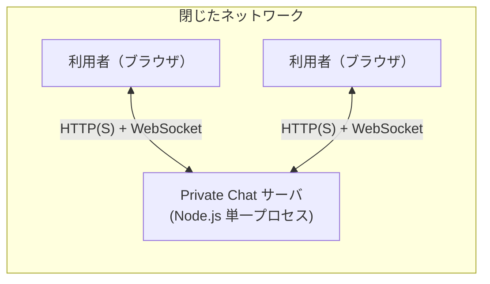
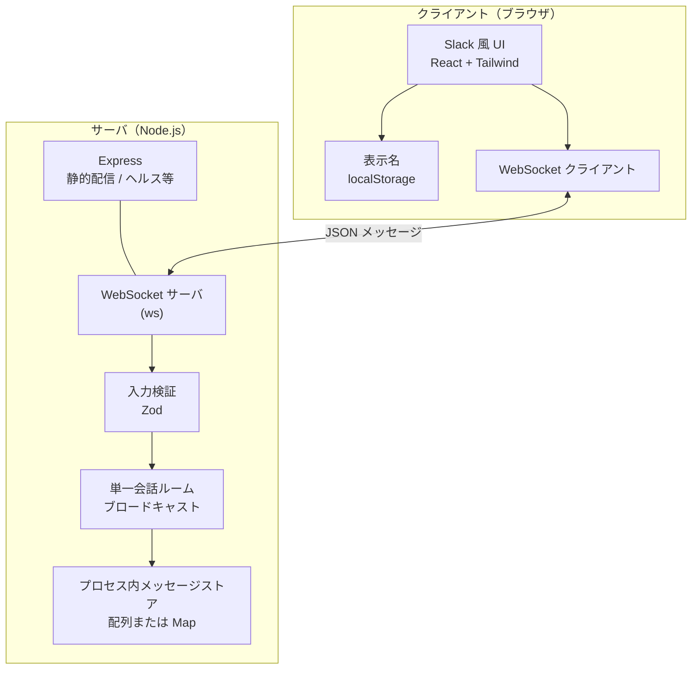

# システム・アーキテクチャ設計書

## 1. 文書管理情報

| 項目 | 内容 |
|------|------|
| 文書名 | Private Chat — システム・アーキテクチャ設計書 |
| 版 | 1.1 |
| 日付 | 2026-04-18 |
| 根拠文書 | [要件仕様書（SRS）](./requirements.md)、[技術スタック](./tech-stack.md) |
| 変更履歴 | 1.0: 初版作成 / 1.1: §5.2 リポジトリ・ディレクトリ構成を追加 |

---

## 2. はじめに

### 2.1 目的

本書は、閉じたネットワーク上で稼働する **Slack ライクな簡易チャット** のソフトウェア構成を定義する。開発者が実装の境界とデータの流れを共有し、SRS の機能・非機能・制約と技術選定の間を追跡できることを目的とする。

### 2.2 範囲

**対象**: ブラウザクライアント（React）、単一の Node.js サーバプロセス（Express + WebSocket）、単一会話スペースにおける投稿の受付とブロードキャスト、プロセス内メモリによるメッセージ保持。

**対象外**: 認証基盤、永続 DB、監視ツール本体、ネットワーク機器の設定。詳細は SRS §2.2 および §8 に従う。

### 2.3 参照

- [要件仕様書（SRS）](./requirements.md)
- [技術スタック](./tech-stack.md)

---

## 3. アーキテクチャ原則と制約

| 原則・制約 | 出典 | アーキテクチャ上の含意 |
|------------|------|------------------------|
| DBMS を使わない | SRS-CSTR-001 | メッセージはサーバプロセスのヒープ上にのみ存在する。水平スケールやプロセス間共有は行わない。 |
| 認証・ログインなし | SRS-CSTR-002 | HTTP / WebSocket に認証ヘッダやセッション Cookie を要求しない。信頼境界は閉じたネットワークに委ねる。 |
| 機能は投稿の送受信に限定 | SRS-CSTR-003 | チャンネル複数化、添付、編集削除などの概念をサーバ・クライアントに持ち込まない。 |
| 単一サーバプロセス | SRS-NF-002 | 可用性はプロセス生存に依存。冗長構成は設計対象外。 |
| TypeScript の共通化 | tech-stack §1 | 投稿ペイロードの型は可能な限りクライアントとサーバで共有する（モノレポまたは共有パッケージを想定）。 |

---

## 4. 運用コンテキスト

利用者は同一の閉じたネットワークから HTTPS（または開発時は HTTP）で Web アプリにアクセスし、サーバホスト上の単一プロセスと WebSocket で常時接続しつつ、投稿を送受信する。VPN やファイアウォールの構成は本システムの責務外である。



---

## 5. 論理アーキテクチャ

システムは **SPA（Vite + React）** と **API／WebSocket サーバ（Express + ws）** の二層で構成する。静的アセットの配信は本番では同一プロセスから行うか、リバースプロキシで front を配信するかはデプロイ方針で決めるが、論理モデル上は「クライアントはサーバのオリジンに接続する」で足りる。



### 5.1 責務の対応関係

| 論理コンポーネント | 主な責務 | 対応する要求（例） |
|--------------------|----------|---------------------|
| UI（React） | 一覧の時系列表示、入力・送信、エラー表示、表示名の編集と永続化 | SRS-UI-001〜004、SRS-IF-003 |
| WebSocket クライアント | 接続維持、送受信 JSON のシリアライズ | SRS-IF-001 |
| Express | 開発時の Vite プロキシ先、本番での静的ファイル配信、必要ならヘルスチェック用 HTTP | SRS-NF-004（運用の入口） |
| WebSocket + 検証 | 投稿受付、スキーマ検証、不正ペイロードの拒否 | SRS-FUNC-001、TBR-002（上限決定後） |
| 単一ルーム・ブロードキャスト | 接続済み全クライアントへの配信 | SRS-FUNC-002 |
| プロセス内ストア | ID・タイムスタンプ付与、メモリ保持 | SRS-FUNC-003、SRS-FUNC-005〜006 |

### 5.2 リポジトリ・ディレクトリ構成

[技術スタック](./tech-stack.md) の **pnpm ワークスペース** と、クライアント／サーバの TypeScript 分離に整合するレイアウトを推奨する。現時点でアプリケーションの `apps/` 等が未作成の場合は、スキャフォールド導入後に実ツリーと突き合わせて本節を更新する。

```text
private-chat/
├── package.json              # pnpm workspace ルート
├── pnpm-workspace.yaml
├── biome.json                # Lint / format（tech-stack §4）
├── apps/
│   ├── web/                  # Vite + React + Tailwind（ブラウザ SPA）
│   │   ├── package.json
│   │   ├── vite.config.ts
│   │   ├── index.html
│   │   └── src/
│   └── server/               # Express + ws（単一プロセス）
│       ├── package.json
│       └── src/
├── packages/
│   └── shared/               # Zod スキーマ・メッセージ型・定数の共有
│       ├── package.json
│       └── src/
├── e2e/                      # Playwright（送信・配信・一覧の E2E）
├── docs/                     # SRS・本書・技術スタック等
├── README.md
├── CONTRIBUTING.md
└── …                         # .github / .cursor 等、運用ファイルはルートに配置
```

**パッケージ間の依存の向き（原則）**

| 依存元 | 依存先 | 備考 |
|--------|--------|------|
| `apps/web` | `packages/shared` | ブラウザ向けバンドルのみに含まれる依存を `web` に置く |
| `apps/server` | `packages/shared` | Node 向けランタイム依存を `server` に置く |
| `packages/shared` | `apps/*` に依存しない | 共有層がアプリに引っ張られないようにする |

**テストコードの置き場**

- **Vitest**: 各アプリの `src` 近傍、または同パッケージ内の `*.test.ts` / `*.spec.ts` とする（tech-stack §5）。
- **Playwright**: クライアントとサーバを立ち上げた複合シナリオが多いため、リポジトリ直下の `e2e/` に集約しやすい。

---

## 6. デプロイメント・実行モデル

- **プロセス境界**: メッセージの真実の源泉（source of truth）は **当該サーバプロセスのメモリ** のみである。別プロセスや別ホストとは共有しない。
- **クライアント**: ビルド成果物は静的ファイルとして配信される。実行時はブラウザ内のみで状態を完結させ、表示名は `localStorage` に保存する（SRS-UI-004）。
- **閉じたネットワーク**: インターネット公開を前提としない。アクセス制御はネットワークレイヤおよび運用ポリシーに依存する（SRS-NF-003）。

---

## 7. リアルタイムとメッセージプロトコル

### 7.1 プロトコル選定（TBR-001 の設計上の解）

**第一手段として WebSocket を採用する**（[技術スタック](./tech-stack.md) §1・§3）。ペイロードは **UTF-8 の JSON テキストフレーム** とする。閉じた LAN・単一会話・双方向の要件に対し、オーバーヘッドの小さい素の WebSocket で十分である（tech-stack §6）。

**フォールバック**: 将来、プロキシ環境で WebSocket が阻害される場合に備え、代替として **HTTP POST による投稿受付 + Server-Sent Events（SSE）によるサーバからクライアントへの一方向ストリーム** を文書レベルで予約する。初期実装では必須としない。

### 7.2 メッセージの論理モデル（概念）

サーバがクライアントへ配信する各投稿には、SRS に従い **一意の識別子** と **サーバ時刻のタイムスタンプ** を付与する（SRS-FUNC-003）。クライアント送信時には少なくとも **表示名** と **本文** を含める。具体的な JSON フィールド名・列挙型は実装フェーズで Zod スキーマと TypeScript 型として固定する。

### 7.3 接続ライフサイクル

- 接続確立後、サーバは必要に応じて **直近のメモリ上メッセージ** を新規接続に送るかどうかを設計選択とする。SRS は履歴再送を要求しないため、**接続前の過去のみ表示しない** 実装も仕様上許容される。同一セッション内の **接続後に発生した投稿の共有** が必須である（SRS-FUNC-002）。
- 切断時は UI 側で再接続ポリシー（指数バックオフ等）を定め、ユーザーに接続状態を示す。

---

## 8. データと状態

| データ | 保持場所 | 寿命 |
|--------|----------|------|
| 投稿一覧（本文・表示名・時刻・ID） | サーバ RAM、各クライアントの表示状態 | サーバはプロセス停止まで。再起動後はサーバ上のコピーは消失（SRS-FUNC-006）。 |
| 表示名 | 各ブラウザの `localStorage` | 利用者が消すまで。サーバはアカウントとして保持しない。 |
| WebSocket 接続集合 | サーバプロセスのみ | プロセスと同寿命。 |

永続ボリューム（RDB・Redis・ファイルログによるメッセージ保管）は採用しない（SRS-CSTR-001）。

---

## 9. セキュリティと信頼境界

本ソフトウェアは **認証・アクセス制御を提供しない**（SRS-NF-003）。そのため、以下を明示する。

- **信頼境界**: 閉じたネットワークに入ったトラフィックは、設計上は正当な利用者からのものとして扱う。
- **脅威の扱い**: 同一ネットワーク内の悪意ある参加者によるなりすまし投稿や DoS は、本アプリケーション単体では防御しない。必要になった場合は上流要求およびネットワーク／認証レイヤの追加を検討する。
- **入力検証**: サーバは Zod 等で構造と長さを検証し、プロセス安定性と表示の一貫性を保つ（tech-stack §3）。これはセキュリティ対策というより品質・耐性のための最小限の措置である。

---

## 10. 非機能要求への対応方針

| 要求 ID | 方針 |
|---------|------|
| SRS-NF-001（2 秒以内の反映目標） | 単一 LAN・同時 50 名未満では WebSocket ブロードキャストと軽量 JSON で十分なはず。計測はブラウザの開発者ツールまたはサーバログのタイムスタンプで検証可能とする。 |
| SRS-NF-002（単一プロセス） | スケールアウトやフェイルオーバをアーキテクチャに含めない。 |
| SRS-NF-004（README で起動可能） | リポジトリの README に、依存関係のインストール（pnpm）、開発サーバと本番ビルドの起動手順を記載する。 |

---

## 11. 品質とテスト観点

[技術スタック](./tech-stack.md) §5 に従い、**Vitest** でドメインロジックと React コンポーネントを、**Playwright** で送信・配信・一覧更新の E2E を検証する。SRS §9 の検証観点（再起動後の非復元、レイアウト等）をテストケースにマッピングする。

---

## 12. 未確定事項と本書の更新条件

| ID | 内容 | 本書への反映 |
|----|------|----------------|
| TBR-002 | 本文最大長・禁止文字 | 決定後、§7.2 および Zod スキーマ仕様に具体値を追記する。 |
| WebSocket 阻害環境 | 代替として POST + SSE を実装する場合 | §7.1 のフォールバックを「実装済み」に更新し、配信経路の図を追加する。 |

---

## 13. 要求・スタックからのトレーサビリティ（要約）

| 本書の節 | 主な根拠 |
|----------|----------|
| §3〜§5 | SRS §2〜§5、tech-stack 全体 |
| §5.2 | tech-stack §1（TS 共有）・§4（pnpm）・§5（Vitest / Playwright） |
| §7 | SRS §4.2・§10 TBR-001、tech-stack §1・§3 |
| §8 | SRS §5.3 |
| §9 | SRS §3.4・§6 SRS-NF-003 |
| §10 | SRS §6 |
| §11 | tech-stack §5、SRS §9 |

以上。
